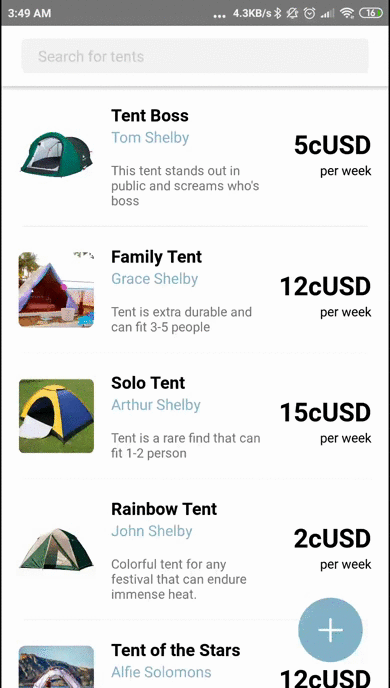
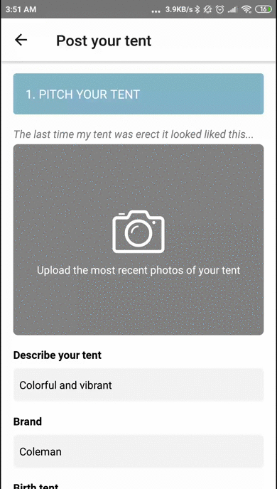

# Introducing
The React Native app for **Rent My Tent** integrated with Celo SDK for transacting users.

## Getting Started
1. Make sure you have [Expo](https://expo.io/) and [Celo Wallet](https://celo.org/developers/wallet) apps installed in your device
2. Get a Celo invite code [here](https://celo.org/developers/faucet).
3. Wait for an SMS with invitation code.
4. Register for a Celo account using Celo Wallet app
5. **IMPORTANT**: don\'t forget to input your invite code in Celo Wallet app from Step 2
6. Create a new account for development (see below)
7. Fund your Celo account [here](https://celo.org/developers/faucet).

**Install developer tools**
```
$ npm install expo-cli --global
```

**Create new account for development**

This script will generate a private key for you. Store it in `/.secret` or create one in root directory if it doesn't exist yet
```
$ npm run account
```

**To run app:**
```
$ cd client
$ expo start
```

**To make a Celo transaction**
1. Select any Tent from the home screen
2. Define rent period
3. Tap on `REQUEST A RENT` button
4. Celo app will prompt for login before creating a mock transaction
5. Transaction receipt can be viewed from the success prompt that will pop-up

# Purpose
To discourage the purchasing of tents as one-time use only and thereby reducing our carbon footprint.

# System Overview
Once a tent is added to the marketplace it will always be available for rent; except during rental periods when the tent is being used by the renter

Tents are rented from one owner to another and are listed back automatically by the borrower to the marketplace after its rental period. 

# Reasoning
Often people purchase tents with only a single-use in mind. This means we have many tents, yet little utility.

In the UK its a particular problem at music festivals where [250,000 tents get left behind every year](https://www.independent.co.uk/life-style/festivals-2019-tent-ban-single-use-plastic-waste-pollution-aif-a8904216.html). This becomes nearly 900 tonnes of plastic waste, most of which ends up in landfill.

Tents are multi-material - nylon, metal, plastic etc., so practically impossible to recycle. The average tent weighs 3.5kg and is mostly made of plastic - the equivalent of 8750 straws.

# Future Development
Transactions are currently being done using [Celo](https://celo.org/) currency.

We plan on leveraging [deposit return scheme](https://www.greenpeace.org.uk/news/deposit-return-schemes-what-exactly-are-they/) to keep the market for tents ongoing.

Tents will also be represented as [NFT](https://en.wikipedia.org/wiki/Non-fungible_token) to encourage more owners to post.

## Post a Tent
Users can post a tent anytime as long as they pay a one-time membership fee. Their tents will be represented as NFT(https://en.wikipedia.org/wiki/Non-fungible_token) in our platform.




## Request a Tent

A user can rent a tent for at least 7 days or more by paying with Celo coins.


